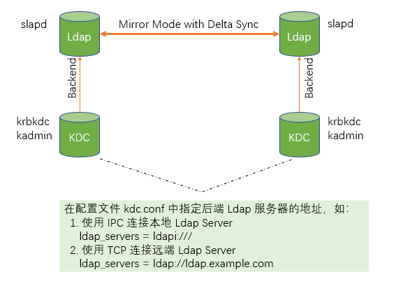
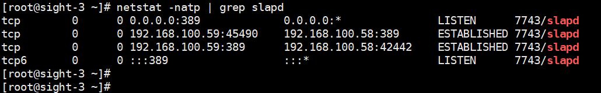

## 基于 Ldap 镜像同步模式（Mirror Mode）的 Ldap & KDC 高可用配置

    
#### 测试环境
| 角色 | 主机名 |
| ---- | ----- |
| CA | sight-3.luqimin.cn |
| Ldap 1 & Kdc 1 | sight-3.luqimin.cn |
| Ldap 2 & Kdc 2 | sihgt-2.luqimin.cn | 
  
### 配置 Ldap Mirror Mode
1. [参考文档：LDAP - Replication with Syncrepl.md](https://github.com/luqimin2005/notes/blob/master/notebooks/LDAP%20-%20Replication%20with%20Syncrepl.md) 配置从 sight-3 到 sight-2 的 Delta-syncrepl 同步  

2. 为 Ldap 服务器添加 ServerID 属性，该属性全局唯一  
    定义 server-id.ldif
    ```
    dn: cn=config
    changetype: modify
    add: olcServerID
    olcServerID: 1
    ```
    分别在两台 Ldap Server 上应用此配置，其中 sight-3 的 ServerID 为 1，sight-2 的 ServerID 为 2
    ```
    [root@sight-3 ~]# ldapmodify -Y EXTERNAL -H ldapi:/// -f server-id.ldif
    [root@sight-2 ~]# ldapmodify -Y EXTERNAL -H ldapi:/// -f server-id.ldif
    ```

3. 在原 Ldap Consumer (sight-2.luqimin.cn)上为主数据库添加属性 olcMirrorMode，并删除属性 olcUpdateRef  
    定义 mirror-on.ldif
    ```
    dn: olcDatabase={2}hdb,cn=config
    changetype: modify
    delete: olcUpdateRef
    -
    add: olcMirrorMode
    olcMirrorMode: TRUE
    ```
    应用该配置文件：
    ```
    [root@sight-2 ~]# ldapmodify -Y EXTERNAL -H ldapi:/// -f mirror-on.ldif
    ```

4. [参考文档：LDAP - Replication with Syncrepl.md](https://github.com/luqimin2005/notes/blob/master/notebooks/LDAP%20-%20Replication%20with%20Syncrepl.md) 配置从 sight-2 到 sight-3 的 Delta-syncrepl 同步  

5. 参考以上第3步，在 sight-3.luqimin.cn 上为主数据库添加属性 olcMirrorMode，并删除属性 olcUpdateRef

    

### 配置 Ldap 作为 Kdc 的后端数据库，两台服务器上都要配置
1. 安装 
    ```
    # yum -y install krb5-server krb5-server-ldap krb5-workstation
    ```
2. 为 Ldap 添加 kerberos.schema
    ```
    # 使用 kerberos.schema 生成 kerberos.ldif

    # cd /usr/share/doc/krb5-server-ldap-1.15.1/
    # echo "include kerberos.schema" > kerberos.conf
    # mkdir out
    # slaptest -f kerberos.conf -F out/

    # 编辑生成的 kerberos.ldif 
    # vim out/cn\=config/cn\=schema/cn\=\{0\}kerberos.ldif 
    dn: cn=kerberos,cn=schema,cn=config
    objectClass: olcSchemaConfig
    cn: kerberos
    ...
    # 删除文件末尾如下几行
    structuralObjectClass:
    entryUUID:
    creatorsName:
    createTimeStamp:
    entryCSN:
    modifiersName:
    modifyTimestamp:
    ```
3. 应用 kerberos.ldif
    ```
    # ldapadd -Y EXTERNAL -H ldapi:/// -f  out/cn\=config/cn\=schema/cn\=\{0\}kerberos.ldif 
    adding new entry "cn=kerberos,cn=schema,cn=config"
    ```
4. 在 Ldap 主数据库中，为 Kerberos 添加索引  
    定义 index.ldif
    ```
    dn: olcDatabase={2}hdb,cn=config
    add: olcDbIndex
    olcDbIndex: krbPrincipalName eq,pres,sub
    ```
    加载 index.ldif
    ```
    # ldapmodify -Y EXTERNAL  -H ldapi:/// -f index.ldif
    modifying entry "olcDatabase={2}hdb,cn=config"
    ```
5. 修改 kdc.conf，将后端数据库指向 ldap  
    为了简单，我们直接绑定"cn=manager,dc=luqimin,dc=cn"连接 Ldap
    ```
    [kdcdefaults]
      kdc_ports = 88
      kdc_tcp_ports = 88

    [realms]
      LUQIMIN.CN = {
        master_key_type = aes256-cts
        kadmind_port = 749
        max_life = 12h
        max_renewable_life = 7d
        acl_file = /var/kerberos/krb5kdc/kadm5.acl
        key_stash_file = /var/kerberos/krb5kdc/.k5.LUQIMIN.CN
        dict_file = /usr/share/dict/words
        admin_keytab = /var/kerberos/krb5kdc/kadm5.keytab
        supported_enctypes = aes256-cts:normal aes128-cts:normal
        database_module = openldap
      }

    [dbmodules]
      openldap = {
        db_library = kldap
        db_module_dir = /usr/lib64/krb5/plugins/kdb/
        ldap_kerberos_container_dn = "cn=krbcontainer,dc=luqimin,dc=cn"
        ldap_kdc_dn = "cn=manager,dc=luqimin,dc=cn"
        ldap_kadmind_dn = "cn=manager,dc=luqimin,dc=cn"
        ldap_service_password_file = /etc/krb5.d/service.keyfile
        ldap_servers = ldapi:///
        ldap_conns_per_server = 5
      }

    [logging]
        kdc = FILE:/var/log/krb5kdc.log
        admin_server = FILE:/var/log/kadmind.log
        default = FILE:/var/log/krb5lib.log

    ```
6. 定义 /etc/krb5.conf ，没有特殊修改
    ```
    [libdefaults]
      renew_lifetime = 7d
      forwardable = true
      default_realm = LUQIMIN.CN
      ticket_lifetime = 24h
      dns_lookup_realm = false
      dns_lookup_kdc = false
      default_ccache_name = /tmp/krb5cc_%{uid}
      #default_tgs_enctypes = aes des3-cbc-sha1 rc4 des-cbc-md5
      #default_tkt_enctypes = aes des3-cbc-sha1 rc4 des-cbc-md5

    [domain_realm]
      .luqimin.cn = LUQIMIN.CN
      luqimin.cn = LUQIMIN.CN

    [logging]
      default = FILE:/var/log/krb5kdc.log
      admin_server = FILE:/var/log/kadmind.log
      kdc = FILE:/var/log/krb5kdc.log

    [realms]
      LUQIMIN.CN = {
        admin_server = sight-3.luqimin.cn
        kdc = sight-3.luqimin.cn
        kdc = sight-2.luqimin.cn
      }

    ```
7. 准备 Kerberos 数据库（仅在一台上执行），并将生成的 key_stash 文件 .k5.LUQIMIN.CN 复制到另一台 Kdc 
    ```
    # kdb5_ldap_util -D cn=manager,dc=luqimin,dc=cn create -r LUQIMIN.CN -s
    Password for "cn=manager,dc=luqimin,dc=cn": 
    Initializing database for realm 'LUQIMIN.CN'
    You will be prompted for the database Master Password.
    It is important that you NOT FORGET this password.
    Enter KDC database master key: 
    Re-enter KDC database master key to verify: 

    # scp /var/kerberos/krb5kdc/.k5.LUQIMIN.CN sight-2:/var/kerberos/krb5kdc/
    ```
8. 创建 Kdc 访问 OpenLdap 的管理员密码存储文件 /etc/krb5.d/service.keyfile
    ```
    # mkdir /etc/krb5.d/
    # kdb5_ldap_util -D cn=manager,dc=luqimin,dc=cn stashsrvpw -f /etc/krb5.d/service.keyfile cn=manager,dc=luqimin,dc=cn
    Password for "cn=manager,dc=luqimin,dc=cn": 
    Password for "cn=manager,dc=luqimin,dc=cn": 
    Re-enter password for "cn=manager,dc=luqimin,dc=cn": 
    ```
9. 分别在两台 Kdc 上启动服务 krb5kdc、kadmin
    ```
    # systemctl start krb5kdc
    # systemctl start kadmin
    # systemctl enable krb5kdc
    # systemctl enable kadmin
    ```
