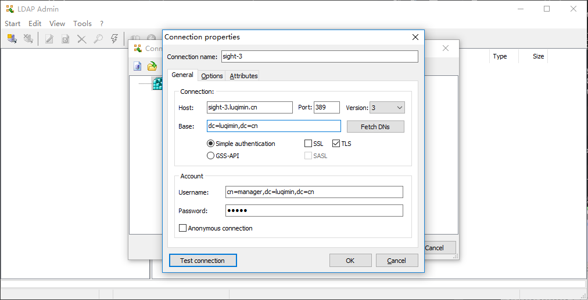
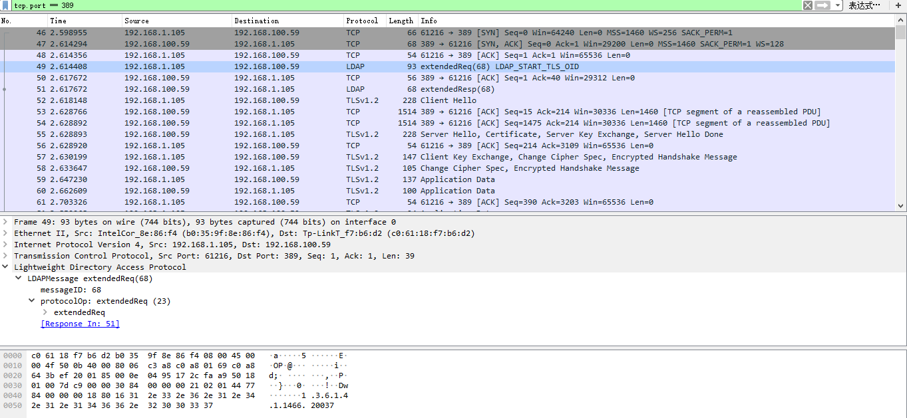
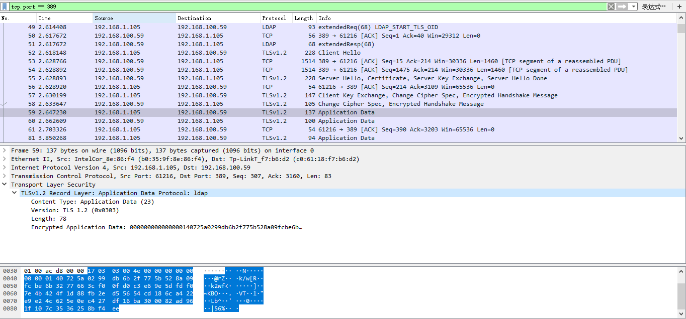

## OpenLdap 开启日志记录功能，使用TLS加密
#### 测试环境
| 角色 | 主机名 |
| ---- | ----- |
| CA | sight-3.luqimin.cn |
| Ldap Server | sight-3.luqimin.cn |

### 启用 OpenLdap 的日志功能
1. 定义 ldif 文件：`log_enable.ldif`
    ```
    # 配置日志级别：states记录ldap连接、操作、结果等信息；sync记录ldap同步信息
    dn: cn=config
    changetype: modify
    replace: olcLogLevel
    olcLogLevel: stats sync
    ```
2. 加载 `log_enable.ldif`
    ```
    # ldapmodify -Y external -H ldapi:/// -f log_enable.ldif
    ```
3. 编辑 rsyslog 的配置文件 /etc/rsyslog.conf，添加 openldap 的日志记录规则，重启 rsyslog 与 slapd 服务
    ```
    # vim /etc/rsyslog.conf
    ...
    local4.*                            /var/log/openldap.log
    ...
    # systemctl restart rsyslog
    # systemctl restart slapd
    ```
### 启用 TLS 加密
1. [参考文档：OpenSSL - Create CA and Sign the Certification for HTTPS.md](https://github.com/luqimin2005/notes/blob/master/notebooks/OpenSSL%20-%20Create%20CA%20and%20Sign%20the%20Certification%20for%20HTTPS.md), 创建 CA 证书颁发机构，并为该服务器签名证书，将 CA根证书、Ldap服务器证书、Ldap服务器私钥文件复制到目录 /etc/openldap/certs/
    * ca.crt
    * sight-3.key
    * sight-3.crt
2. 定义 ldif 文件：`tls.ldif`
    ```
    # 删除原配置文件中定义的CA证书存放目录：olcTLSCACertificatePath
    dn: cn=config
    changetype: modify
    delete: olcTLSCACertificatePath

    # 增加CA根证书的文件路径：olcTLSCACertificateFile
    dn: cn=config
    changetype: modify
    add: olcTLSCACertificateFile
    olcTLSCACertificateFile: /etc/openldap/certs/ca.crt

    # 修改服务器证书文件的存放路径：olcTLSCertificateFile
    dn: cn=config
    changetype: modify
    replace: olcTLSCertificateFile
    olcTLSCertificateFile: /etc/openldap/certs/sight-3.crt

    # 修改服务器证书私钥文件的存放路径： olcTLSCertificateKeyFile
    dn: cn=config
    changetype: modify
    replace: olcTLSCertificateKeyFile
    olcTLSCertificateKeyFile: /etc/openldap/certs/sight-3.key

    # 定义客户端身份验证模式：olcTLSVerifyClient；never表示不验证客户端身份
    dn: cn=config
    changetype: modify
    add: olcTLSVerifyClient
    olcTLSVerifyClient: never
    ```
3. 加载 `tls.ldif`
    ```
    # ldapmodify -Y external -H ldapi:/// -f tls.ldif
    ```
4. 使用 TLS 连接 Ldap 服务器
    这里我们使用 [Ldapadmin.exe](http://www.ldapadmin.org/) 连接上述 Ldap 实例：
    
    使用 Wireshark 抓包，我们可以看到当前已使用 TLS 进行数据传输：
    
    
