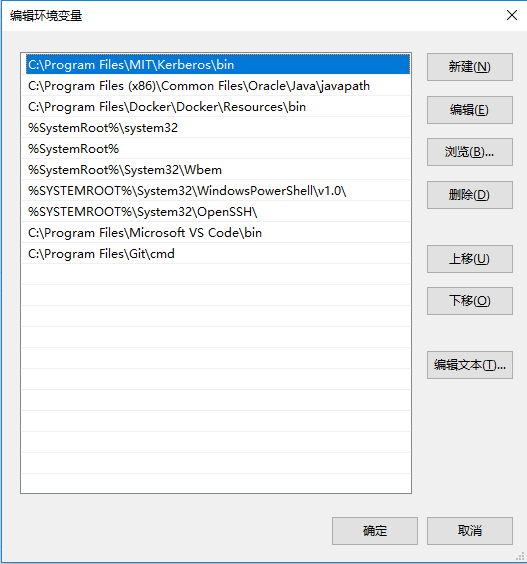
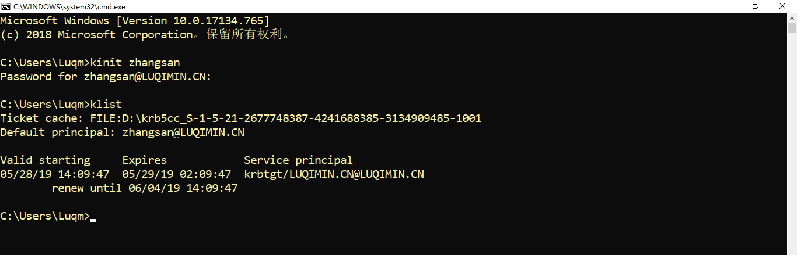
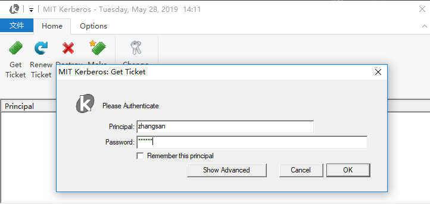
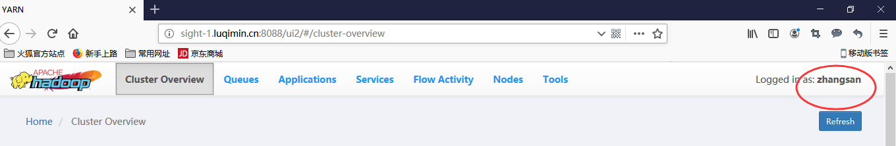

## 为 Hadoop 启用 SPNEGO 验证

### 服务端配置
1. 集群启用 Kerberos 认证

2. 创建用于签署身份验证令牌的密钥，并传输到每个节点：

    ```
    # dd if=/dev/urandom of=/etc/security/http_secret bs=1024 count=1
    # chown hdfs:hadoop /etc/security/http_secret
    # chmod 440 /etc/security/http_secret
    ```
3. 修改属性 core-site.xml  

    | 属性 | 值 |
    | --- | --- |
    | hadoop.http.authentication.simple.anonymous.allowed | false |
    | hadoop.http.authentication.signature.secret.file | /etc/security/http_secret |
    | hadoop.http.authentication.type | kerberos |
    | hadoop.http.authentication.kerberos.keytab | /etc/security/keytabs/spnego.service.keytab |
    | hadoop.http.authentication.kerberos.principal | HTTP/_HOST@LUQIMIN.CN |
    | hadoop.http.filter.initializers | org.apache.hadoop.security.AuthenticationFilterInitializer |
    | hadoop.http.authentication.cookie.domain | luqimin.cn |

### 客户端配置
1. 下载安装 [MIT Kerberos for Windows 4.1](http://web.mit.edu/kerberos/dist/#kfw-4.1)

2. 修改配置文件：C:\ProgramData\MIT\Kerberos5\krb5.ini  
复制 /etc/krb5.conf 的内容（logging除外）到 krb5.ini ，如
    ```
    [libdefaults]
    renew_lifetime = 7d
    forwardable = true
    default_realm = LUQIMIN.CN
    ticket_lifetime = 24h
    dns_lookup_realm = false
    dns_lookup_kdc = false
    default_ccache_name = D:\krb5cc_%{uid}
    #default_tgs_enctypes = aes des3-cbc-sha1 rc4 des-cbc-md5
    #default_tkt_enctypes = aes des3-cbc-sha1 rc4 des-cbc-md5

    [domain_realm]
    .luqimin.cn = LUQIMIN.CN
    luqimin.cn = LUQIMIN.CN

    [realms]
    LUQIMIN.CN = {
        admin_server = sight-3.luqimin.cn
        kdc = sight-3.luqimin.cn
        kdc = sight-2.luqimin.cn
    }
    ```
3. 修改环境变量，确保 C:\Program Files\MIT\Kerberos\bin 在最前面，如
    

4. 使用 firefox，打开配置页面 `about:conifg`，修改如下参数：

    | 参数 | 值 |
    | --- | ---|
    | network.negotiate-auth.trusted-uris | .luqimin.cn |
    | network.negotiate-auth.delegation-uris | .luqimin.cn |
    | network.auth.use-sspi | false |


### 验证
1. 使用命令行认证
    
    或使用客户端界面认证
    

2. 打开 YARN WebUI，右上角显示登录用户
    